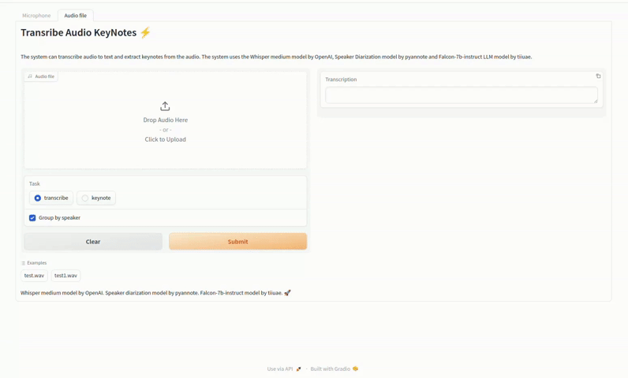
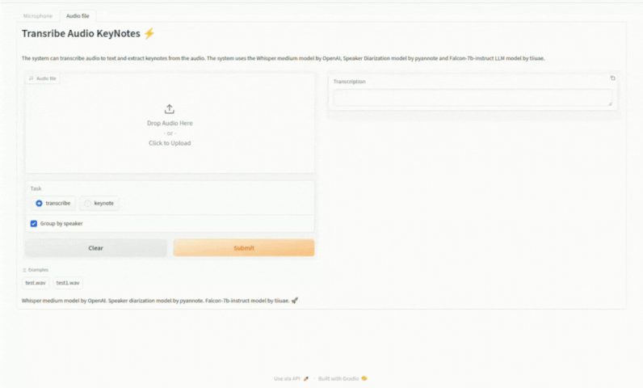
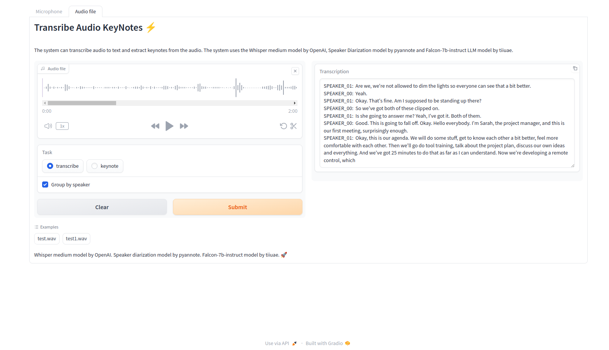
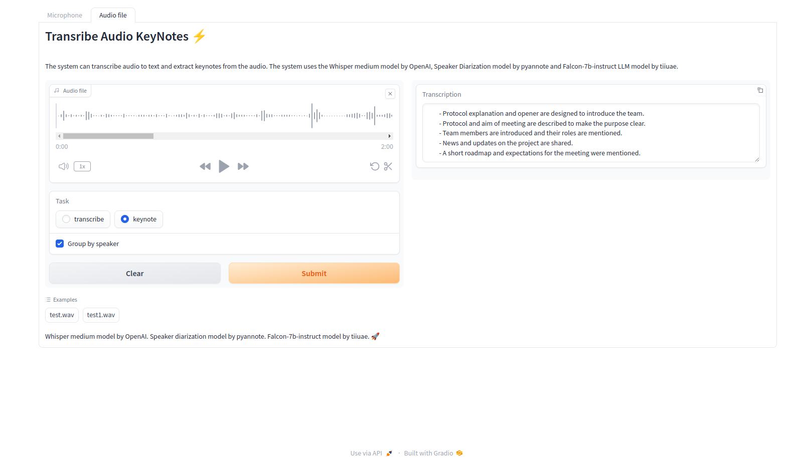

# Audio Transcription and Summarization with Speaker Diarization

This project aims to transcribe audio files using the Whisper model, perform speaker diarization using PyAnnot, and summarize the transcribed text using Falcon-7B-Instruct and prompt-engineering techniques.

## Demo
<!--  
 -->

<div align="center">
  
  <p>Figure: Transcribe with diarization</p>
</div>

<div align="center">
  
  <p>Figure: Summarization</p>
</div>

# Installation

## Requirements

- Python 3.7+
- Transformers
- Poetry (optional but recommended)
- CUDA

## Setup

1. Clone the repository:
   ```bash
   git clone https://github.com/zwe-htet-paing/Transcribe-Audio-Keynotes.git
   cd Transcribe-Audio-Keynotes
   ```

2. Install the required dependencies:
- If you are using poetry, just run `poetry install` in the cloned directory
- Otherwise, create a virtual environment (recommended), activate it, and then use pip to install the requirements: `pip install -r requirements.txt`.

## Setting Up API Keys

1. **Create .env file**: Create a file named `.env` in the root directory of the project.

2. **Add API keys for Hugging Face**: Open the `.env` file and add your API keys for Hugging Face. Ensure that the API keys are properly formatted and securely stored. For example:

   ```plaintext
   HF_TOKEN="HUGGINGFACE_API_KEY"
   ```
    

## Run Gradio demo

To run the Gradio demo, follow these steps:

1. **Run Command**: Execute the following command in your terminal:

   ```bash
   # using poetry
   poetry run python demo.py

   # using other environments
   python demo.py
   ```

2. **Accessing the Demo**: Once the demo is running, you can access it locally using the following URL: `http://127.0.0.1:7860`


<!-- <div align="center">
  
  <p>Figure: Transcribe with diarization</p>
</div>

<div align="center">
  
  <p>Figure: Summarization</p>
</div> -->


## Acknowledgments

This project is built upon the HuggingFace's open-source models.

- [openai's whisper-medium](https://huggingface.co/openai/whisper-medium)
- [pynnnot's spearker-diarization-3.0](https://huggingface.co/pyannote/speaker-diarization-3.0)
- [falcon-7B-Instruct](https://huggingface.co/tiiuae/falcon-7b-instruct)


## Future Improvements

While the current version of the project is functional and utilizes open-source transformer models, there are several areas where further enhancements and optimizations can be made. Here's a list of tasks and improvements:

- **Improved Speaker Diarization**: Enhance the accuracy and efficiency of speaker diarization algorithms by exploring advanced machine learning techniques and models.

- **Custom Summarization Strategies**: Implement custom summarization strategies tailored to specific use cases and domains, such as keyword extraction, abstractive summarization, and sentiment analysis.

- **Real-time Transcription**: Develop real-time audio transcription capabilities to enable live streaming and instant feedback applications.

- **Integration with Additional Models**: Integrate and evaluate other state-of-the-art speech recognition and natural language processing models to improve transcription accuracy and language understanding.

- **Enhanced User Interface**: Design and implement a user-friendly web interface or desktop application for easy access to audio transcription and summarization functionalities.

- **Multi-language Support**: Extend support for transcribing and summarizing audio in multiple languages by incorporating multilingual models and language-specific preprocessing techniques.

- **Optimized Deployment**: Optimize deployment workflows and infrastructure configurations for seamless deployment to various cloud platforms and environments.

---
 